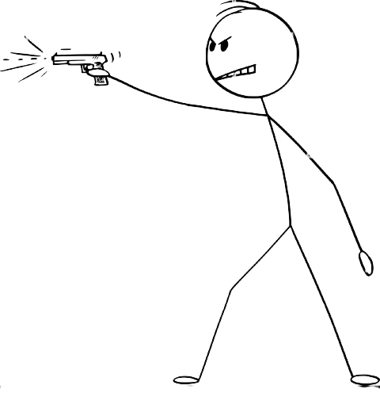

# Welcome
{: .fs-9 }

__*I plan to create awesomeness. I don't know where I'm heading, but I'm thrilled. I'm a bit exhausted.*__

[Wiki @ Main](https://r8w.github.io/){: .btn .mr-2 } [Wiki @ Study](https://r8w.github.io/notes/){: .btn .btn .mr-2 }

{: .fs-6 .fw-300  }

---

## Introduction

I'm an avid note-taker. I write most of the things that I get to experience, encounter, or feel because if I don't, I might kill myself. What's funny about my death thoughts is that I'm genuinely afraid of it, and I don't think I'll ever accumulate enough courage to wound or kill myself. I don't underestimate the force of reality, but I'm highly aware of my cowardness toward death. In the persistent and never-ending combat of life versus demise, I hide behind the words to save myself.

This wiki represents a part of my life that I'm comfortably willing to share without the awareness of anyone. It's also an attempt to organize my thoughts and understand a good portion of my existence.

 

 

*Psychological Warfare --- Reality vs Ability*
{: .text-center }

 

## and...

Through words, I plan to fix myself and be a better person. I do not prefer discussing my life with anyone, but I find peace in breaking down my thoughts. It gives me a sense of perspective and time to think. No, I'm not an escapist. I don't live in my ideological echo chamber. I've realized that one should do what works best for them, but the trick is not to pretend that the method you've picked is merely an illusion rather than a solution.

On the practical side of this quest of conquering my battle with emotions and making peace with a few of them, I remain neutral and unaware of how triumphant I will be. Life is about figuring out what works best for you and befriending the process that makes you realize the essence of reality.

*Let's see what happens!*

